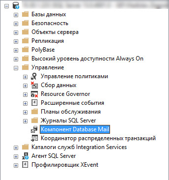

# Настройка SQL Server для отправки email писем

## Оглавление

* ### [Описание](#Описание)

* ### [Подготавливаем сервер](#Подготавливаем-сервер)

* ### [Создаем аккаунт](#Создаем-аккаунт)

* ### [Создаем профиль](#Создаем-профиль)

* ### [Добавляем аккаунт в профиль](#Добавляем-аккаунт-в-профиль)

* ### [Предоставляем профилю публичные права на отправку](#Предоставляем-профилю-публичные-права-на-отправку)

* ### [Проверка нашего профиля](#Проверка-нашего-профиля)

* ### [Удаление](#Удаление)

* ### [Альтернативный вариант](#Альтернативный-вариант)

---

* ### [Вернуться](../different.md)

## Описание

Последнее время при разработке в системе `WebTutor` часто появляются мысли, что было бы неплохо отслеживать некоторые моменты на стороне SQL Server и ежедневно отправлять какие либо email письма на почту с данными или просто оповещением. В этой статье мы займемя настройкой SQL Server.

Что необходимо для настройки:

  1. Сервер SQL, где хранятся данные WebTutor
  2. Роль администратора на сервере SQL
  3. Сервер SMTP - почтовый сервер
  4. Данные для подключения к SMTP серверу

Я не профи в области администрирования серверов или глубоких познаний в SQL, все что будет описано в этой статье протестировано на нескольких серверах. Если у вас возникли проблемы на каких-либо этапах, обратитесь за помощью к вашим специалистам, устраните ошибки и продолжайте дальше.

## Подготавливаем сервер

Мы будем работать с БД `msdb`, для этого проверим текущее состояние сервис-брокер, выполнив запрос:

```sql
SELECT   name
        ,database_id
        ,is_broker_enabled
FROM sys.databases
```

Если в поле `is_broker_enabled` у нас стоит значение `0`, то выполняем следующий SQL запрос:

```sql
ALTER DATABASE msdb SET ENABLE_BROKER WITH ROLLBACK IMMEDIATE;
```

После этого проверка предыдущим запросом должна показать `1` в поле `is_broker_enabled` для базы `msdb`.

Включаем опцию `DatabaseMail XPs` через системную процедуру `sp_configure`, выполнив следующий запрос:

```sql
GO
sp_configure 'show advanced', 1     -- Включаем расширенное отображение списка конфигурации
RECONFIGURE
GO
sp_CONFIGURE 'Database Mail XPs', 1 -- включаем опцию использования email
RECONFIGURE
```

Для проверки включения опции запустите процедуру `sp_configure` без каких-либо опций:

```sql
sp_configure
```

Найдите в списке строку `Database Mail XPs` и убедитесь, что поля `config_value` и `run_value` имеют значение `1`.


## Создаем аккаунт

**ВАЖНО!!!**

1. Вместо переменных вы можете использовать просто строки для их указания.
2. Процедура `sysmail_add_account_sp` имеет гораздо больше параметров, включая порт сервера, логин, пароль и т.д. Узнать подробнее можно по ссылке [sysmail_add_account_sp](https://docs.microsoft.com/ru-ru/sql/relational-databases/system-stored-procedures/sysmail-add-account-sp-transact-sql?view=sql-server-ver15)

```sql
-- Формируем переменные для аккаунта
DECLARE @disp_name varchar(100) = 'Мониторинг '+ CAST(CONNECTIONPROPERTY('local_net_address') AS varchar) +' сервера';
DECLARE @em_adress varchar(100) = (SELECT CAST(CONNECTIONPROPERTY('local_net_address') AS varchar) + '@SQLServer');

-- Создание аккаунта
EXECUTE msdb.dbo.sysmail_add_account_sp
    @account_name = 'monitoring_agent',
    @description = 'Отправка писем с вложеными результатами по мониторингу кафетерия льгот',
    @email_address = @em_adress,
    @replyto_address = @em_adress,
    @display_name = @disp_name,
    @mailserver_name = '10.10.10.10';
```

## Создаем профиль

Создаем профиль:

```sql
-- Создание профиля
EXECUTE msdb.dbo.sysmail_add_profile_sp
    @profile_name = 'monitoring_agent_profile',
    @description = 'Профиль для отправки публичных писем по мониторингу кафетерия льгот' ;
```

Подробнее о процедуре создания профиля [sysmail_add_profile_sp](https://docs.microsoft.com/vi-vn/sql/relational-databases/system-stored-procedures/sysmail-add-profile-sp-transact-sql?view=sql-server-2017)

## Добавляем аккаунт в профиль

Не забудьте, если вы меняете имена аккаунта или профиля при создании, то тут они должны соответсвовать.

```sql
-- Добавляем аккаунт в профиль
EXECUTE msdb.dbo.sysmail_add_profileaccount_sp
    @profile_name = 'monitoring_agent_profile',
    @account_name = 'monitoring_agent',
    @sequence_number = 1 ;
```

`@sequence_number` - порядковый номер аккааунта в профиле, так как наш профиль новый, то добавляемый аккаунт будет под номером `1`.

Подробнее о процедуре добавления аккаунта к профилю [sysmail_add_profileaccount_sp](https://docs.microsoft.com/ru-ru/sql/relational-databases/system-stored-procedures/sysmail-add-profileaccount-sp-transact-sql?view=sql-server-ver15)

## Предоставляем профилю публичные права на отправку

Тут мы будем давать профилю публичные права на отправку, тоесть любой пользователь может использовать наш профиль и отправлять через него сообщения.

```sql
EXECUTE msdb.dbo.sysmail_add_principalprofile_sp
    @profile_name = 'monitoring_agent_profile',
    @principal_name = 'public',
    @is_default = 1 ;
```

Подробнее о процедуре предоставления прав профилю [sysmail_add_principalprofile_sp](https://docs.microsoft.com/ru-ru/sql/relational-databases/system-stored-procedures/sysmail-add-principalprofile-sp-transact-sql?view=sql-server-ver15)

## Проверка нашего профиля

После всех настроек мы должны иметь возможность отправлять письма. Для проверки сформируем тело письма и отправим его на свой адрес.

Для отправки писем используется процедура `sp_send_dbmail`, которая имеет множество аргументов про которые можно почитать по [этой ссылке](https://docs.microsoft.com/ru-ru/sql/relational-databases/system-stored-procedures/sp-send-dbmail-transact-sql?view=sql-server-ver15). Мы же используем минимальный набор для тестирования и выполним следующий запрос:

```sql
exec  msdb.dbo.sp_send_dbmail
    @Profile_name = 'monitoring_agent_profile',
    @Recipients   = 'vladislav.zagoskin@...',
    @body = 'Тестовое письмо',
    @body_format = 'TEXT',
    @Subject = 'Проверка';
```

Результатом должно быть присланное сообщение на указанную почту, мне пришло так:


## Удаление

Чтобы удалить аккаунт из профиля, достаточно выполнить процедуру `sysmail_delete_profileaccount_sp` с указанием профиля и аккаунта:

```sql
EXECUTE msdb.dbo.sysmail_delete_profileaccount_sp
    @profile_name = 'monitoring_agent_profile',
    @account_name = 'monitoring_agent'
```

Для удаления аккаунта можно воспользоваться процедурой `sysmail_delete_account_sp` с указанием имени аккаунта:

```sql
EXECUTE msdb.dbo.sysmail_delete_account_sp
    @account_name = 'monitoring_agent'
```

Для удаления профиля можно воспользоваться процедурой `sysmail_delete_profile_sp` с указанием имени профиля:

```sql
EXECUTE msdb.dbo.sysmail_delete_profile_sp
    @profile_name = 'monitoring_agent_profile'
```

## Альтернативный вариант

SQL Server предоставляет графический интерфейс для настройки отправки email писем, для этого нужно подключиться к серверу и в обозревателе объектов найти пункт `Компоненты Database Mail` и запустить его.



Откроется интерфейс для настройки.

### [Вверх](#Настройка-SQL-Server-для-отправки-email-писем)
