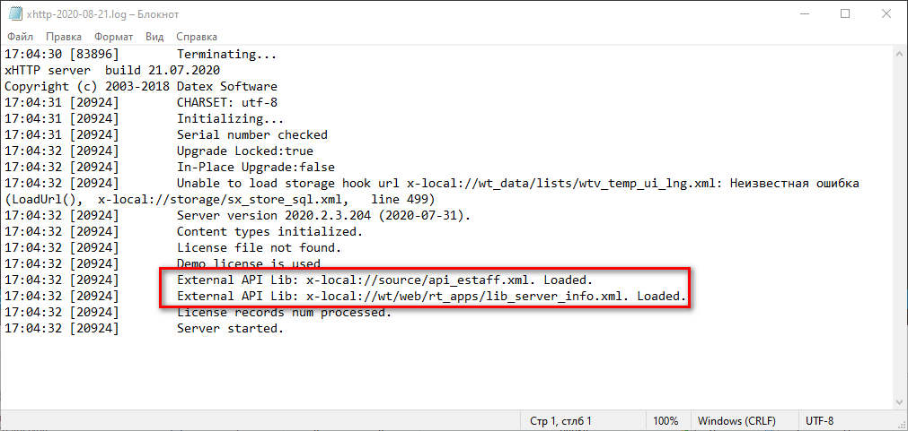
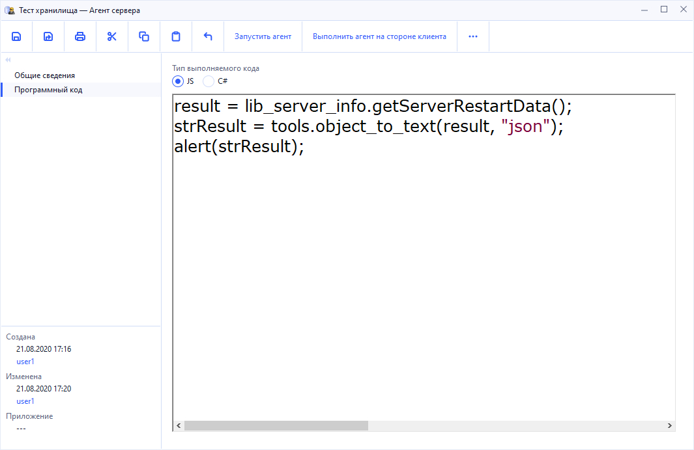
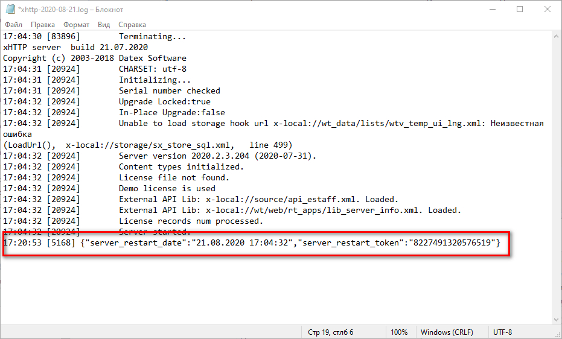

# Отслеживаем и получаем информацию о перезагрузке сервера

## Содержание

* [писание разработки](#Описание-разработки)
* [Настраиваем файл автоматической загрузки библиотеки](#Настраиваем-файл-автоматической-загрузки-библиотеки)
* [Создаем файл для хранения информации о перезагрузке сервера](#Создаем-файл-для-хранения-информации-о-перезагрузке-сервера)
* [Создаем xml файл для библиотеки](#Создаем-xml-файл-для-библиотеки)
* [Создаем js файл с функциями для работы с хранилищем](#Создаем-js-файл-с-функциями-для-работы-с-хранилищем)
* [Испытания](#Испытания)

## Описание разработки

Для некоторых длительных сервисов понадобилось реализовать доработку, которая бы позволила получать данные о том, когда был перезагружен сервер. Помимо даты и времени, необходимо хранить некое случайное 16-значное число, которое присваивается при каждом перезапуске сервера.

Для разработки используется механизм подключения собственной библиотеки. Пост об этом есть на форуме WebSoft, [ссылка на пост](https://news.websoft.ru/view_doc.html?mode=forum_entry&doc_id=&object_id=6621797040509906716).

Механизм отслеживания перезагрузки сервера не зависит от того, как развернут сервер и с какой БД он работает. Соответственно все можно расширять под свои нужды, в этой статье описывается механизм.

Краткий алгоритм разработки:
* "Включаем" коробочный файл, который подгружает кастомные библиотеки.
* Создаем файл `.xml`, выполняющий роль хранилища.
* Создаем файл `.xml` для инициализации библиотеки, который подгружает функции из `.js` файла, а так же содержит блок кода, записывающий данные в хранилище.
* Создаем файл `.js` с функциями библиотеки, которые будут позволять получать информацию из информационного файла
* При каждой перезагрузке сервер заново регистрирует библиотеку. При инициализации библиотеки выполняется код, обновляющий данные в хранилище, и загружаются функции, которые позволяют работать с хранилищем.

При каждой перезагрузке, сервер автоматически регистрирует библиотеку, в этот момент обновляется файл с информацией и подгружаются функции для работы с этим файлом. После чего в любом серверном коде можно использовать данную функцию и получить данные из файла.

Все создаваемые файлы можно хранить в любых директориях, кроме корневой `WebTutorServer`. Проверялось на папках `WebTutorServer/wt`, `WebTutorServer/wt_data` и `WebTutorServer/wtv`. 

## Настраиваем файл автоматической загрузки библиотеки

В папке `WebTutorServer/source` находим коробочный файл `api_ext(sample).xml`, создаем дубликат этого файла под названием `api_ext.xml`.

Данный файл уже содержит шаблонный код для подключения API E-Staff
```xml
<?xml version="1.0" encoding="utf-8"?>
<api_ext>
	<apis>
		<api>
			<name>E-Staff API</name>
			<libs>
				<lib>
					<path>x-local://source/api_estaff.xml</path>
				</lib>
			</libs>
		</api>
	</apis>
</api_ext>
```

Нам необходимо изменить файл, и добавить блок `api` для подключения собственной библиотеки  
В узел `name` вписываем название нашей библиотеки.  
В узел `path` вписываем относительный путь до `.xml` файла с описанием нашей библиотеки. В моем случае файлы библиотеки `.xml` и `.js` находятся в папке `wt/web/rt_apps` относительно корневой папки сервера `WebTutorServer`.
```xml
<?xml version="1.0" encoding="utf-8"?>
<api_ext>
	<apis>
		<api>
			<name>E-Staff API</name>
			<libs>
				<lib>
					<path>x-local://source/api_estaff.xml</path>
				</lib>
			</libs>
		</api>
		<api>
			<name>server_info</name>
			<libs>
				<lib>
					<path>x-local://wt/web/rt_apps/lib_server_info.xml</path>
				</lib>
			</libs>
		</api>
	</apis>
</api_ext>
```

На этом настройка коробочного файла закончена.

## Создаем файл для хранения информации о перезагрузке сервера

Для хранения информации будем использовать файл формата `.xml`, по аналогии с глобальным файлом настроек `wtv_global_settings.xml`.

В папке `wt/web/rt_apps`, где будет храниться подгружаемая библиотека, создадим файл `server_info.xml` со следующей структурой
```xml
<?xml version="1.0" encoding="utf-8"?>
<global_info>
	<server_restart_date></server_restart_date>
	<server_restart_token></server_restart_token>
</global_info>
```

Именно в этот файл мы будем производить запись данных и их чтение. Соответственно, все поля вымышленные, их можно добавлять, удалять и менять названия на собственные.

## Создаем xml файл для библиотеки

Для указания файла с функциями нашей библиотеки используется файл `.xml`, который будет говорить серверу, под каким именем зарегистрировать библиотеку и из какого файла `.js` нужно загрузить сами функции.

В папке `wt/web/rt_apps` относительно корневой папки сервера создаем файл `lib_server_info.xml`. Этот путь и название файла мы указывали в файле `api_ext.xml`.
```xml
<?xml version="1.0" encoding="utf-8"?>
<!--Указываем путь до файла js с функциями-->
<SPXML-INLINE-FORM CODE-LIB-URL="x-local://wt/web/rt_apps/lib_server_info.js">
    
    <!--Название узла - название библиотеки по которому можно будет обращаться напрямую-->
    <lib_server_info>
    </lib_server_info>

    <!--Вызывается при открытии текущего документа (на сервере или на клиенте)-->
    <OnInit PROPERTY="1" EXPR="
        // указываем относительный путь до хранилища
        url = 'x-local://wt/web/rt_apps/server_info.xml';
        tiInfo = null;

        // Если хранилище найдено - выполняем действия над ним
        if ( tools.file_url_exists( url ) ) {
            // Открываем хранилище
            docInfo = OpenDoc( url )
            teInfo = docInfo.TopElem;
    
            // Обновляем данные в хранилище
            teInfo.server_restart_date = Date();
            teInfo.server_restart_token = Random(1000000000000000, 9999999999999999);
    
            // Сохраняем хранилище
            docInfo.Save();
        }
    "/>
</SPXML-INLINE-FORM>
```

Именно этот файл, который загружается только один раз при старте сервера, будет выполнять роль триггера перезагрузки сервера. При инициализации будет вызываться собственный метод в котором мы и обновляем данные о перезагрузке сервера:).

## Создаем js файл с функциями для работы с хранилищем

Для получения методов для работы с хранилищем, создадим файл `lib_server_info.js`, где создадим всего одну функцию, которая будет возвращать объект с данными о времени перезагрузке и "токеном текущей сессии сервера".

```js
function getServerRestartData() {
    // указываем относительный путь до хранилища
    url = "x-local://wt/web/rt_apps/server_info.xml";
    tiInfo = null;
    data = {};

    // Если хранилище найдено - выполняем действия над ним
    if ( tools.file_url_exists( url ) ) {
        teInfo = OpenDoc( url ).TopElem;

        // формируем объект с данными из хранилища
        data = {
            "server_restart_date": RValue(teInfo.server_restart_date),
            "server_restart_token": RValue(teInfo.server_restart_token)
        }
    }
    
    // Возвращаем объект
    return data;
}
```

## Испытания

Все испытания проводились на локальном сервере, работающем в режиме "Сервис". Для чистоты эксперимента можно очистить папку `Logs`, где хранятся логи `.txt`.

Перезагружаем сервер и смотрим основной лог `xhttp-2020-##-##.log`. Если все библиотеки загрузились, мы увидим следующий текст в логе  


Открываем файл хранилище и смотрим, обновились ли данные о перезагрузке сервера. Изначально данные в хранилище були пустыми.  


Чтобы проверить работоспособность функции, которая возвращает данные о перезагрузке сервера воспользуемся агентом. Агент вызовет функцию, и возвращенный результат выведет в лог.

Открываем админку и создаем пустой агент со следующим кодом
```js
result = lib_server_info.getServerRestartData();
strResult = tools.object_to_text(result, "json");
alert(strResult);
```


Запускаем агент на стороне сервера, так как на клиенте данные функции не доступны. Дополнительно убеждаемся, что функция из библиотеки доступна через "быстрый набор".

Смотрим основной лог `xhttp-2020-##-##.log`, где должны увидеть данные из хранилища в виде объекта  



